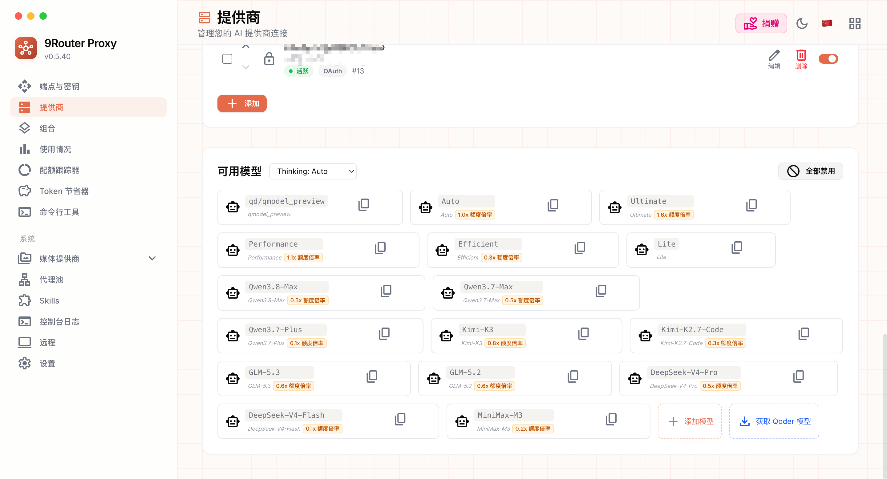

# 9router-qoder-plus

这是基于原项目 [decolua/9router](https://github.com/decolua/9router) 的完整源码增强版。

原项目 9Router 是一个面向 Claude Code、Codex、Cursor、Cline、OpenCode 等 AI 编程工具的本地/自部署 AI Router，提供 OpenAI-compatible API、Claude/OpenAI 格式转换、多 Provider 管理、额度追踪、RTK Token Saver、Fallback/Combo 路由等能力。

### Qoder 排队不中断

针对 Qoder 在高峰期常见的排队响应做了增强：

- 识别 HTTP `403`、错误码 `10605`、`isQueued:true`、`queueType:slow`。
- 遇到排队不再马上返回错误给 Claude Code/Codex，而是在服务端原地等待并重试。
- 默认最多重试 15 次，退避等待从 5 秒开始，最大 60 秒。
- 排队结束后客户端会继续收到正常模型响应，会话不需要手工“继续”。


_Qoder 排队时进入等待并按配置重试，而不是把排队响应直接返回为失败。_

### Qoder 流式错误兜底

Qoder 有时不是直接返回 HTTP 错误，而是在已经建立的 SSE 流中返回错误 envelope。本版处理了这些情况：

- SSE 首包 `403 / 10605 / isQueued:true` 会进入同一套排队重试。
- SSE 首包 `504 / upstream model timeout` 会按临时失败重试。
- 重试时刷新 `request_id`、`request_set_id`、`chat_record_id` 并重新签名，避免 Qoder 返回 `Duplicate request`。
- 进入排队后会立即建立 SSE，并持续发送 keepalive，避免 Codex 在排队阶段因长时间无数据而主动终止。
- Qoder 上游工具调用缺少 `id` 时会自动生成稳定 ID，不再静默丢失工具调用。
- Responses API 中 reasoning、message、function call 使用独立递增的 `output_index`，避免 Codex 将工具调用误判为 reasoning 的重复输出。

### Qoder 上下文超限正确报错

Qoder 在请求被上游拒绝时（最常见的是上下文超过模型上限），返回的是 HTTP `200` + SSE 首包 `statusCodeValue:400` 的错误 envelope，真正的错误信息还被嵌套了三层 JSON。原版会把这段错误直接当成助手正文（`[qoder error 400: ...]`）返回，客户端因此认为这一轮"成功"了：把乱码正文写进历史继续重试，上下文越滚越大，每次都要等上游约 1 分钟才拒绝，日志里还记成 `success` 并按字节估算出几百万 token 的假用量。

本版改为：

- 在向下游写出第一个字节之前就识别错误 envelope，直接返回真实的 HTTP `400/5xx`，请求详情记录为 `error`，不再伪造 token 用量。
- 解码嵌套的上游错误原文，超长时使用客户端能识别的标准措辞（`maximum context length` / `prompt is too long` / `reduce the length`），Codex、Claude Code 收到后会走自己的压缩（compact）逻辑，而不是无声死循环。
- 完整错误原文写入容器日志（`[QODER] upstream envelope error 400 (context overflow) · {...}`），便于排查。
- `400` 这类"请求体本身被拒"的错误不再触发账号轮换：换任何一个账号都会被同样拒绝，旧逻辑只会把整个账号池按顺序锁一遍。
- `/v1/models` 中所有 Qoder 模型统一返回 `contextWindow=1000000`、`auto_compact_token_limit=900000`；Qoder 实时目录中的不一致窗口值不再参与客户端规划。

### Qoder 超时参数可配置

原版固定的流式超时在大上下文请求下容易过早中断。本版增加了 Qoder 专用环境变量：

| 环境变量 | 默认值 | 说明 |
| --- | --- | --- |
| `QODER_QUEUE_MAX_ATTEMPTS` | `15` | Qoder 排队最多重试次数 |
| `QODER_QUEUE_BASE_DELAY_MS` | `5000` | 首次排队重试等待时间 |
| `QODER_QUEUE_MAX_DELAY_MS` | `60000` | 单次排队重试最大等待时间 |
| `QODER_KEEPALIVE_MS` | `10000` | 排队及流式静默期间发送 SSE keepalive 的间隔 |
| `QODER_TIMEOUT_MAX_ATTEMPTS` | `3` | Qoder 首 token 超时（504 First Token Timeout）最多重试次数 |
| `QODER_TIMEOUT_BASE_DELAY_MS` | `3000` | 首 token 超时首次重试等待时间 |
| `QODER_TIMEOUT_MAX_DELAY_MS` | `15000` | 首 token 超时单次重试最大等待时间 |
| `QODER_AUTO_CONTINUE_MAX` | `1` | 模型“宣布下一步却停回合”时的自动续跑次数（0 关闭） |
| `QODER_STREAM_TIMEOUT_MS` | `600000` | 等待 Qoder 返回响应头的超时时间 |
| `QODER_STALL_TIMEOUT_MS` | `600000` | Qoder 流式响应两段字节之间的最大空闲时间 |

默认配置约等于：排队最多等待 10 分钟左右，流式空闲超时 10 分钟。

### Qoder 自动续跑（防“聊着聊着就停”）

部分 Qoder 模型偶尔会在说完“我先看一下……/Let me check …:”这类下一步宣告后直接以 `stop` 结束回合、却不发工具调用，客户端（Codex / Claude Code）会把这当成正常结束，表现为任务中途停住。本版在流结束时会检测这种“悬挂意图”（短文本 + 冒号或意图动词结尾、且本回合没有任何工具调用、请求带工具），自动发起一次隐藏续跑请求（附带“立即执行你刚宣布的步骤”的提示），并把续跑流拼接进同一条响应；日志会打印 `auto-continue 1/1 ...`。默认最多续跑 1 次，可用 `QODER_AUTO_CONTINUE_MAX=0` 关闭。

### Qoder 额度增强

Qoder 的额度不只有套餐内额度，还可能有资源包。本版增强了额度解析：

- 识别 `userQuota`，显示为 `Personal`。
- 识别 `orgResourcePackage.cap`，显示为 `Resource Package`。
- Dashboard 额度页可以同时看到套餐额度和资源包额度。

### API Key 账号限制和额度分配

Dashboard -> Endpoint 的 API Key 管理中，新增了面向 Qoder 的 Key 级别限制能力：

- 可以为某个 API Key 指定只能使用某一个或某几个 Qoder 账号。
- 可以按账号分别分配额度，而不是只能给这个 Key 设置一个总额度。
- 分配上限按账号剩余可分配额度计算，例如账号 A 可用 10000 时可以只给某个 Key 分配 5000，账号 B 可用 2000 时可以只分配 1000。
- 账号列表会同时显示其它 Key 已占用的额度和当前还可分配额度，避免手动心算。
- 运行时会按每个账号自己的分配额度统计消耗，某个账号的分配额度用完后，再切到下一个可用账号。
- 页面会显示当前 Key 的 `Used / Total`、`Remaining`、`Active Account`，方便判断这个 Key 已使用多少、总共分配多少、当前正在消费哪个账号。
- `Consumption Priority` 会展示每个账号的分配额度、已使用额度和剩余分配额度。
- 在消费优先级列表中，已用完的账号会置灰并显示 `Exhausted`，当前正在消费的账号会显示浅橙色底和 `In use`。
- `Reset usage` 支持重置当前 Key 的 Qoder 用量统计，并已适配简体中文确认弹窗。
- 当某个 API Key 分配的 Qoder 额度全部用完时，可以发送钉钉告警。
- 单个账号的额度接口读取失败（例如 token 失效返回 401）不会再让整个 Key 的配额检查失效。系统会跳过该账号、继续对其它账号做配额校验，并发送钉钉告警提示重新授权。
- 已经被验证为"分配额度已用完"的账号会从路由池中移除，不会被继续命中；额度暂时读取不出来的账号保持可用（fail-open），不会因瞬时网络错误被误伤。
- 客户端中途断连的请求也会把已产生的 token 写入用量记录，方便和账号扣费对账。


_Key 分配页面支持按 Qoder 账号分别填写可消费额度，并显示当前可分配额度、当前 Key 的已用量、剩余额度和当前账号。_

交互上分成两个区域：

- `Qoder Accounts`：只负责选择账号和填写每个账号分配的 credits。
- `Consumption Priority`：单独设置消费优先级。选择账号的先后顺序不会再隐式决定消费顺序，需要在这里用上移/下移按钮明确调整。


_消费优先级单独设置，明确控制多个已选账号的消费顺序，并标识当前正在使用或已用完的账号。_

这样做的原因是 Qoder 缓存命中率和账号连续消费有关。你可以让某个 Key 优先消耗账号 A，A 的分配额度用完后再消耗账号 B，避免多个账号来回切换影响缓存。

### Qoder 模型列表增强

Qoder 官方软件里可选的模型，有些不会稳定出现在 9Router 原始模型列表中。本版增强了模型发现和对外 ID 展示：

- 优先从 Qoder `/model/list` 获取实时 enabled chat 模型，避免静态列表跟不上 Qoder 官方软件里的新模型。
- 新模型会直接使用 Qoder 返回的 `display_name` 作为默认对外模型 ID，例如 `Qwen3.8-Max`、`Kimi-K3`。
- 如果 Qoder live catalog 获取成功，`/v1/models` 只暴露当前 live catalog 中仍存在的模型；已经从 Qoder 移除的旧模型不会再因为历史自定义模型或 alias 重新出现在模型列表里。
- `/v1/models` 中 Qoder 模型默认返回 `Qwen3.8-Max` 这类可读名称，不再把 `qd/qmodel_38max` 作为主展示 ID。
- Dashboard -> Providers -> Qoder 的模型卡片可以编辑 `Public Model ID`，用于控制客户端看到和调用的模型 ID。
- 编辑弹窗中保留只读的 `Qoder Internal ID`，用于排查真实上游绑定关系。
- 客户端可以直接请求 `{ "model": "Qwen3.8-Max" }`，9Router 会在内部映射回 Qoder 真实 key `qmodel_38max`。
- 旧调用方式 `qd/<model>`、`qoder/<model>` 继续兼容；同时兼容裸内部 ID，例如 `qmodel_38max`。如果你已经配置了同名 model alias，alias 会优先于 Qoder 内部 ID。
- 识别并透传 Qoder 返回的 `price_factor` / `original_price_factor`，模型卡片会展示 `0.6x 额度倍率` 这类倍率标签，`/v1/models` 也会返回对应字段。



_Qoder 模型列表优先展示 display name，并显示每个模型的额度倍率；复制和客户端调用默认使用可读模型 ID。_

### Qoder 多模态输入

本版已支持 Claude Code 与 Codex 通过 9router 向 Qoder 传递图片输入，覆盖以下场景：

- Claude Code 用户消息中直接粘贴或拖拽的图片。
- Claude Code `tool_result` 中的工具截图或图片。
- Codex Responses 请求中的 `input_image`。
- Codex `function_call_output.output` 数组中的图片。

处理流程：

1. Claude `image` 图片块会转换为 OpenAI `image_url`，Codex `input_image` 同样转换为 `image_url`。
2. Claude `tool_result` 或 Codex `function_call_output` 中出现图片时，工具文本仍保留在 tool 消息中，图片会追加为紧随其后的用户图片消息，并通过 `tool_use_id` 或 `call_id` 关联原工具调用。
3. Qoder adapter 将图片转换为 `messages[].contents`：

```json
{
  "role": "user",
  "content": "",
  "contents": [
    {
      "type": "image_url",
      "image_url": {
        "url": "data:image/png;base64,..."
      }
    },
    {
      "type": "text",
      "text": "描述这张图片"
    }
  ]
}
```

4. 图片存在时，Qoder `model_config.is_vl` 和 `chat_context.extra.modelConfig.is_vl` 会设置为 `true`，顶层 `image_urls` 和 `chat_context.imageUrls` 保持 `null`，图片实际通过 `messages[].contents` 传递。

视觉能力判断优先参考 Qoder 实时模型目录中的 `is_vl`，但会对已知误标模型做保守覆盖：

- 视觉能力以 Qoder 实时模型目录的 `is_vl` 为准（例如 DeepSeek-V4-Pro / DeepSeek-Flash 均为 `is_vl: true`，支持图片输入；`lite` 为 `is_vl: false`，收到图片时本地拒绝）。
- `auto`、`ultimate`、`performance`、`efficient` 等路由档位不会显示为原生视觉模型。
- 非视觉模型收到图片时，9router 会在本地返回 HTTP 400，不把无效图片请求发送到 Qoder。

图片 URL 支持 data URL 和 HTTP/HTTPS URL。仅提供 `file_id`、没有有效 `image_url` 的图片会返回明确错误，不会把文件 ID 当作 URL 发送。

### CC-Switch 用量查询

本版新增 CC-Switch 兼容的 `POST /api/usage` 接口，使用 API Key 鉴权：

```bash
curl -X POST http://127.0.0.1:20128/api/usage \
  -H "Authorization: Bearer <apiKey>" \
  -H "User-Agent: cc-switch/1.0"
```

同时支持常见的 `GET /user/balance` 别名：

```bash
curl http://127.0.0.1:20128/user/balance \
  -H "Authorization: Bearer <apiKey>" \
  -H "User-Agent: cc-switch/1.0"
```

该别名会额外返回 `is_active` 字段，其余额度字段与 `/api/usage` 一致。

返回字段包含 `isValid`、`balance`、`remaining`、`total`、`used`、`unit`、`planName` 和 `extra`。Qoder 配额单位固定为 `credits`。

对于已分配额度的 Key，返回该 Key 的分配额度、累计精确消耗和剩余额度。对于没有分配额度的 Key，返回所有启用 Qoder 账号及资源包的汇总可用额度。

Qoder 每次成功调用的 usage 帧中会返回实际 `credits` 消耗。9router 会按请求所属的 API Key 和账号精确累计，共享同一账号的多个 Key 不会互相计入对方用量。

本次 CC-Switch 适配同时修复了以下用量边界：

- 已分配额度的 Key 按每次请求返回的真实 credits 持久化累计，不再通过账号余额下降推测其它 Key 的消耗。
- 同一个 Qoder 账号被多个 Key 共享时，每个 Key 只记录自己发起的调用。
- 账号额度接口读取失败时保持未知状态，不再被当成零额度，避免 Key 已用量突然暴涨。
- 账号额度重新增长时不会被错误标记为 exhausted，也不会从路由池中移除。
- 旧版本已经记录的用量作为历史下限保留，升级后不会归零。
- `Reset usage` 按钮仍是唯一会主动清空当前 Key 累计用量的入口。

### 钉钉告警

Dashboard -> Profile 新增 `Model Idle Alert` 配置区。

用途：统一配置 9router 的钉钉机器人告警。目前会在以下场景发送消息：

- `模型空闲告警`：监控“最后一次成功模型调用”之后是否长时间没有新的成功调用。如果超过阈值，发送钉钉告警。
- `API Key 使用率阈值告警`：当任意 API Key 的已用分配额度达到配置的百分比阈值，例如 `80%`，发送钉钉告警。这个告警不拦截请求，只用于提前提醒。
- `API Key 分配额度耗尽告警`：当某个 API Key 绑定的 Qoder 分配额度已经用完，并且本次请求因此被拒绝时，发送钉钉告警。
- `账号额度读取失败告警`：当某个 Qoder 账号的额度接口读取失败（例如 token 失效），系统跳过该账号继续校验其它账号，同时发送钉钉告警。该告警按账号单独冷却，避免重复刷屏。
- `测试告警`：在设置页面点击 `Test DingTalk`，会立即发送一条测试消息，用于验证 webhook 和加签配置是否可用。


_钉钉告警设置支持空闲阈值、告警冷却、Webhook、加签 Secret 和消息模板。_

配置项：

| 配置项 | 说明 |
| --- | --- |
| `DingTalk Alert` | 是否启用钉钉告警。关闭后模型空闲告警、API Key 使用率阈值告警和 API Key 额度耗尽告警都会停止发送 |
| `Idle Minutes` | 模型空闲阈值。比如填 `5`，最后一次成功模型调用后连续 5 分钟没有新成功调用就告警 |
| `Alert Cooldown` | 告警冷却。模型空闲告警、API Key 使用率阈值告警和 API Key 额度耗尽告警都会使用这个冷却时间 |
| `API Key Usage Threshold` | 是否启用 API Key 使用率阈值告警 |
| `Usage Threshold Percent` | API Key 已用分配额度百分比阈值。例如填 `80`，当某个 Key 的 `已用额度 / 总分配额度 >= 80%` 时发送告警 |
| `DingTalk Webhook` | 钉钉自定义机器人 webhook |
| `DingTalk Secret` | 钉钉机器人加签 secret。保存后不回显，留空表示保留旧值 |
| `Message Template` | 模型空闲告警消息模板，支持 `{idleMinutes}`、`{lastCallAt}`、`{now}`。API Key 使用率阈值告警和额度耗尽告警使用内置模板，包含 Key 名称、Provider、使用率、阈值、用量、剩余量和时间 |

行为说明：

- 每次成功模型调用都会刷新 `lastModelCallAt`。
- 达到 `Idle Minutes` 后，同一个空闲窗口只告警一次。
- 新的成功模型调用会重置下一轮空闲窗口。
- API Key 使用率阈值按 `已用额度 / 总分配额度` 判断，达到阈值后发送告警；未达到总额度时请求仍会继续执行。
- API Key 使用率阈值告警按 Key 单独冷却：同一个 Key 在冷却时间内不会重复刷屏，不同 Key 互不影响。
- API Key 分配额度耗尽告警按 Key 单独冷却：同一个 Key 在冷却时间内不会重复刷屏，不同 Key 互不影响。
- API Key 相关告警消息不会包含原始 API Key 密钥值。
- `Alert Cooldown` 填 `0` 表示不额外冷却。
- 页面提供 `Test DingTalk` 按钮，可保存配置后立即发送测试消息。

### Codex 接入（模型元数据与思考展示）

Codex 对**自定义 provider 不会请求 `/v1/models`**，它读取本地缓存 `~/.codex/models_cache.json`：该缓存**只有 300 秒有效期**，且必须与客户端版本匹配、每个模型都必须带指令模板。缓存不存在或过期时，Codex 会退回内置的 272k 兜底元数据 —— 表现就是**长会话压缩过晚（撞上下文）**、**思考过程不展示**。

**推荐做法（一次安装、永久生效）：把模型目录"内置"进客户端**——生成一份静态目录文件，再用一行配置指向它。它没有 300 秒过期问题，也不需要运行时常驻脚本：

```bash
node scripts/codex-models-cache.mjs --base http://<9router>:20128 --key <API_KEY> \
  --catalog-out ~/.codex/models_catalog.json --merge-bundled
# --merge-bundled 会调用 `codex debug models` 取回客户端自带的目录并合并，
# 这样不会丢掉 Codex 自身依赖的辅助模型（否则会出现 gpt-5.x 之类的 fallback 警告）
```

```toml
model_catalog_json = "/home/<you>/.codex/models_catalog.json"
```

模型有增减或 Codex 升级后，重新跑一次上面的命令即可（静态文件不会自动过期）。

**备选做法（动态缓存，300 秒过期）**：

```bash
node scripts/codex-models-cache.mjs --base http://<9router>:20128 --key <API_KEY>
# 可选：--client-version 0.154.0（默认先读现有缓存，其次读 `codex --version`）
# 可选：--out ~/.codex/models_cache.json
```

`config.toml` 参考（Codex CLI / 桌面端）：

```toml
model = "DeepSeek-Flash"
model_provider = "nine"
model_context_window = 1000000
model_auto_compact_token_limit = 900000
model_reasoning_effort = "high"
model_reasoning_summary = "detailed"

[model_providers.nine]
name = "9router"
base_url = "http://<9router>:20128/v1"
env_key = "NINER_KEY"
wire_api = "responses"
```

因为缓存 300 秒即过期，建议**每次启动 Codex 前跑一次刷新脚本**（放进 shell 别名或启动包装脚本）。

验证是否生效（应为 `0`）：

```bash
RUST_LOG=codex_models_manager=warn codex exec --json "hello" 2>&1 >/dev/null | grep -c "fallback model metadata"
```
## Docker 部署

### 时区（可选）

本版 Dockerfile 默认时区为 `Asia/Shanghai`。部署到其它地区时，可以通过 `TZ` 环境变量覆盖，例如：

```bash
-e TZ=America/New_York
```

本版镜像已经安装 `tzdata`，无需额外挂载宿主机时区文件。

验证容器时间：

```bash
docker exec 9router date '+%Y-%m-%d %H:%M:%S %Z %z'
```

输出示例：

```text
2026-09-10 08:29:21 EDT -0400
```

### 方式一：本地构建镜像

```bash
git clone https://github.com/MoonCoder-HAPPY/9router-qoder-plus.git
cd 9router-qoder-plus

docker build -t 9router-qoder-plus:latest .
```

启动容器：

```bash
docker run -d \
  --name 9router \
  --restart unless-stopped \
  -p 20128:20128 \
  -v "$HOME/.9router:/app/data" \
  -e DATA_DIR=/app/data \
  -e HOSTNAME=0.0.0.0 \
  -e PORT=20128 \
  -e NODE_ENV=production \
  -e REQUIRE_API_KEY=true \
  -e JWT_SECRET='replace-with-a-long-random-secret' \
  -e INITIAL_PASSWORD='change-me' \
  -e NEXT_TELEMETRY_DISABLED=1 \
  -e TZ=Asia/Shanghai \
  -e QODER_QUEUE_MAX_ATTEMPTS=15 \
  -e QODER_QUEUE_BASE_DELAY_MS=5000 \
  -e QODER_QUEUE_MAX_DELAY_MS=60000 \
  -e QODER_KEEPALIVE_MS=10000 \
  -e QODER_TIMEOUT_MAX_ATTEMPTS=3 \
  -e QODER_TIMEOUT_BASE_DELAY_MS=3000 \
  -e QODER_TIMEOUT_MAX_DELAY_MS=15000 \
  -e QODER_STREAM_TIMEOUT_MS=600000 \
  -e QODER_STALL_TIMEOUT_MS=600000 \
  9router-qoder-plus:latest
```

访问：

- Dashboard: `http://服务器IP:20128/dashboard`
- OpenAI-compatible endpoint: `http://服务器IP:20128/v1`
- Health check: `http://服务器IP:20128/api/health`

### 方式二：docker compose

如果你希望用 compose 管理，可以新建 `docker-compose.yml`：

```yaml
services:
  9router:
    build: .
    image: 9router-qoder-plus:latest
    container_name: 9router
    restart: unless-stopped
    ports:
      - "20128:20128"
    volumes:
      - ./data:/app/data
    environment:
      DATA_DIR: /app/data
      HOSTNAME: 0.0.0.0
      PORT: "20128"
      NODE_ENV: production
      REQUIRE_API_KEY: "true"
      JWT_SECRET: replace-with-a-long-random-secret
      INITIAL_PASSWORD: change-me
      NEXT_TELEMETRY_DISABLED: "1"
      TZ: Asia/Shanghai
      QODER_QUEUE_MAX_ATTEMPTS: "15"
      QODER_QUEUE_BASE_DELAY_MS: "5000"
      QODER_QUEUE_MAX_DELAY_MS: "60000"
      QODER_KEEPALIVE_MS: "10000"
      QODER_TIMEOUT_MAX_ATTEMPTS: "3"
      QODER_TIMEOUT_BASE_DELAY_MS: "3000"
      QODER_TIMEOUT_MAX_DELAY_MS: "15000"
      QODER_STREAM_TIMEOUT_MS: "600000"
      QODER_STALL_TIMEOUT_MS: "600000"
```

启动：

```bash
docker compose up -d --build
```

查看日志：

```bash
docker logs -f 9router
```

### 方式三：在 VPS 上部署

以 Ubuntu VPS 为例：

```bash
sudo apt-get update
sudo apt-get install -y git docker.io docker-compose-plugin
sudo systemctl enable --now docker

git clone https://github.com/MoonCoder-HAPPY/9router-qoder-plus.git
cd 9router-qoder-plus

sudo docker build -t 9router-qoder-plus:latest .
```

启动：

```bash
mkdir -p "$HOME/.9router"

sudo docker run -d \
  --name 9router \
  --restart unless-stopped \
  -p 20128:20128 \
  -v "$HOME/.9router:/app/data" \
  -v /usr/share/zoneinfo/Asia/Shanghai:/etc/localtime:ro \
  -e DATA_DIR=/app/data \
  -e HOSTNAME=0.0.0.0 \
  -e PORT=20128 \
  -e NODE_ENV=production \
  -e REQUIRE_API_KEY=true \
  -e JWT_SECRET='replace-with-a-long-random-secret' \
  -e INITIAL_PASSWORD='change-me' \
  -e NEXT_TELEMETRY_DISABLED=1 \
  -e TZ=Asia/Shanghai \
  -e QODER_KEEPALIVE_MS=10000 \
  -e QODER_TIMEOUT_MAX_ATTEMPTS=3 \
  -e QODER_TIMEOUT_BASE_DELAY_MS=3000 \
  -e QODER_TIMEOUT_MAX_DELAY_MS=15000 \
  -e QODER_STREAM_TIMEOUT_MS=600000 \
  -e QODER_STALL_TIMEOUT_MS=600000 \
  9router-qoder-plus:latest
```

验证：

```bash
curl -fsS http://127.0.0.1:20128/api/health
sudo docker logs -f 9router
```

健康检查应返回：

```json
{"ok":true}
```

## 数据目录和升级

容器内数据目录是 `/app/data`。建议挂载到宿主机目录，例如：

```bash
-v "$HOME/.9router:/app/data"
```

升级前建议先备份：

```bash
cp -a "$HOME/.9router" "$HOME/.9router.bak-$(date +%Y%m%d-%H%M%S)"
```

升级镜像：

```bash
git pull
docker build -t 9router-qoder-plus:latest .
docker stop 9router
docker rm 9router
# 然后用原 docker run 参数重新启动
```

## 常用操作

查看日志：

```bash
docker logs -f 9router
```

停止：

```bash
docker stop 9router
```

删除容器但保留数据：

```bash
docker rm 9router
```

进入容器：

```bash
docker exec -it 9router sh
```

## 开发运行

```bash
npm install
PORT=20128 NEXT_PUBLIC_BASE_URL=http://localhost:20128 npm run dev
```

生产构建：

```bash
npm run build
PORT=20128 HOSTNAME=0.0.0.0 NEXT_PUBLIC_BASE_URL=http://localhost:20128 npm run start
```

相关单测：

```bash
npm --prefix tests install
npm --prefix tests test -- \
  unit/model-idle-alert.test.js \
  unit/qoder-quota.test.js \
  unit/qoder-glm52-model.test.js \
  unit/api-key-policy.test.js \
  unit/api-key-policy-auth.test.js \
  unit/api-key-policy-db.test.js \
  unit/api-key-restrictions-modal-source.test.js \
  unit/zh-cn-literals.test.js \
  unit/antigravity-oauth-client.test.js
```

## License

本仓库基于 [decolua/9router](https://github.com/decolua/9router) 修改，继承 upstream MIT License。详见 [LICENSE](./LICENSE)。
