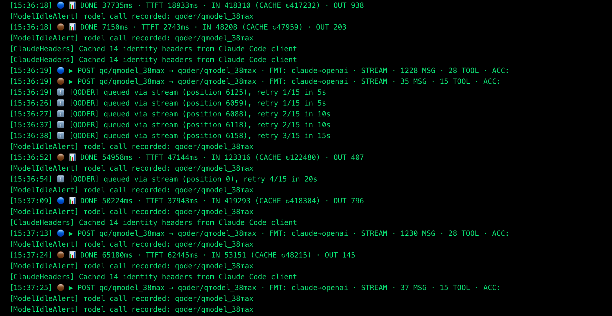
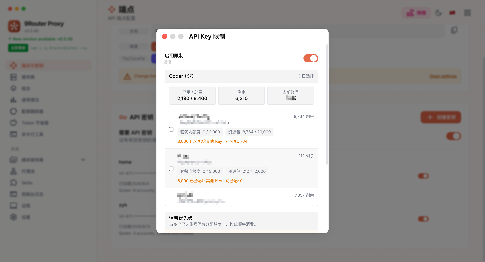
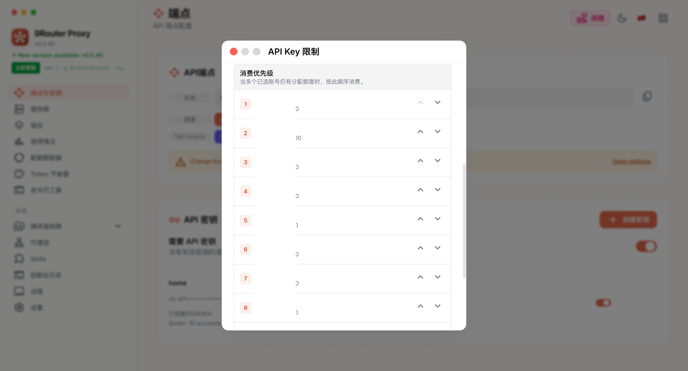
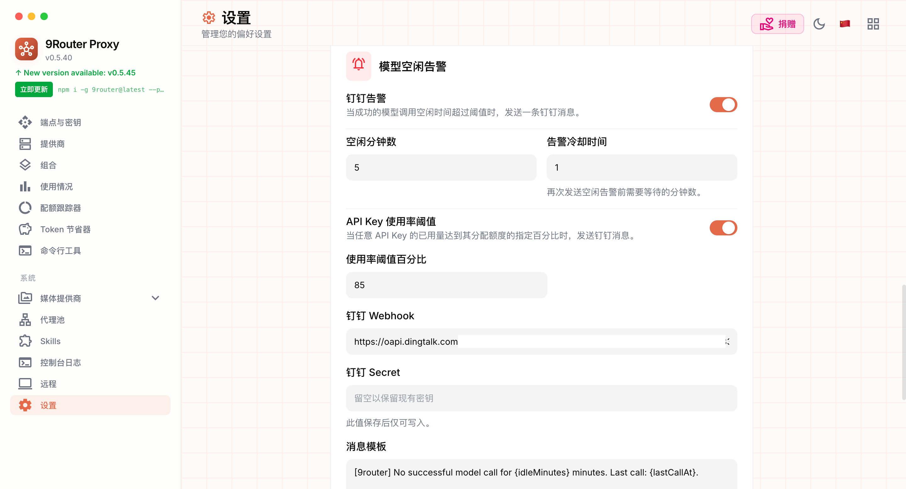

# 9router-qoder-plus

这是基于原项目 [decolua/9router](https://github.com/decolua/9router) 的完整源码增强版。

原项目 9Router 是一个面向 Claude Code、Codex、Cursor、Cline、OpenCode 等 AI 编程工具的本地/自部署 AI Router，提供 OpenAI-compatible API、Claude/OpenAI 格式转换、多 Provider 管理、额度追踪、RTK Token Saver、Fallback/Combo 路由等能力。

## 这版改了什么

### Qoder 排队不中断

针对 Qoder 在高峰期常见的排队响应做了增强：

- 识别 HTTP `403`、错误码 `10605`、`isQueued:true`、`queueType:slow`。
- 遇到排队不再马上返回错误给 Claude Code/Codex，而是在服务端原地等待并重试。
- 默认最多重试 15 次，退避等待从 5 秒开始，最大 60 秒。
- 排队结束后客户端会继续收到正常模型响应，会话不需要手工“继续”。



_Qoder 排队时进入等待并按配置重试，而不是把排队响应直接返回为失败。_

### Qoder 流式错误兜底

Qoder 有时不是直接返回 HTTP 错误，而是在已经建立的 SSE 流中返回错误 envelope。本版处理了这些情况：

- SSE 首包 `403 / 10605 / isQueued:true` 会进入同一套排队重试。
- SSE 首包 `504 / upstream model timeout` 会按临时失败重试。
- 重试时刷新 `request_id`、`request_set_id`、`chat_record_id` 并重新签名，避免 Qoder 返回 `Duplicate request`。

### Qoder 超时参数可配置

原版固定的流式超时在大上下文请求下容易过早中断。本版增加了 Qoder 专用环境变量：

| 环境变量 | 默认值 | 说明 |
| --- | --- | --- |
| `QODER_QUEUE_MAX_ATTEMPTS` | `15` | Qoder 排队最多重试次数 |
| `QODER_QUEUE_BASE_DELAY_MS` | `5000` | 首次排队重试等待时间 |
| `QODER_QUEUE_MAX_DELAY_MS` | `60000` | 单次排队重试最大等待时间 |
| `QODER_STREAM_TIMEOUT_MS` | `600000` | 等待 Qoder 返回响应头的超时时间 |
| `QODER_STALL_TIMEOUT_MS` | `600000` | Qoder 流式响应两段字节之间的最大空闲时间 |

默认配置约等于：排队最多等待 10 分钟左右，流式空闲超时 10 分钟。

### Qoder 额度增强

Qoder 的额度不只有套餐内额度，还可能有资源包。本版增强了额度解析：

- 识别 `userQuota`，显示为 `Personal`。
- 识别 `orgResourcePackage.cap`，显示为 `Resource Package`。
- Dashboard 额度页可以同时看到套餐额度和资源包额度。

### API Key 账号限制和额度分配

Dashboard -> Endpoint 的 API Key 管理中，新增了面向 Qoder 的 Key 级别限制能力：

- 可以为某个 API Key 指定只能使用某一个或某几个 Qoder 账号。
- 可以按账号分别分配额度，而不是只能给这个 Key 设置一个总额度。
- 分配上限按账号剩余可分配额度计算，例如账号 A 可用 10000 时可以只给某个 Key 分配 5000，账号 B 可用 2000 时可以只分配 1000。
- 账号列表会同时显示其它 Key 已占用的额度和当前还可分配额度，避免手动心算。
- 运行时会按每个账号自己的分配额度统计消耗，某个账号的分配额度用完后，再切到下一个可用账号。
- 页面会显示当前 Key 的 `Used / Total`、`Remaining`、`Active Account`，方便判断这个 Key 已使用多少、总共分配多少、当前正在消费哪个账号。
- `Consumption Priority` 会展示每个账号的分配额度、已使用额度和剩余分配额度。
- 在消费优先级列表中，已用完的账号会置灰并显示 `Exhausted`，当前正在消费的账号会显示浅橙色底和 `In use`。
- `Reset usage` 支持重置当前 Key 的 Qoder 用量统计，并已适配简体中文确认弹窗。
- 当某个 API Key 分配的 Qoder 额度全部用完时，可以发送钉钉告警。



_Key 分配页面支持按 Qoder 账号分别填写可消费额度，并显示当前可分配额度、当前 Key 的已用量、剩余额度和当前账号。_

交互上分成两个区域：

- `Qoder Accounts`：只负责选择账号和填写每个账号分配的 credits。
- `Consumption Priority`：单独设置消费优先级。选择账号的先后顺序不会再隐式决定消费顺序，需要在这里用上移/下移按钮明确调整。



_消费优先级单独设置，明确控制多个已选账号的消费顺序，并标识当前正在使用或已用完的账号。_

这样做的原因是 Qoder 缓存命中率和账号连续消费有关。你可以让某个 Key 优先消耗账号 A，A 的分配额度用完后再消耗账号 B，避免多个账号来回切换影响缓存。

### Qoder 模型列表增强

Qoder 官方软件里可选的模型，有些不会稳定出现在 9Router 原始模型列表中。本版增加了静态兜底：

- 增加当前 Qoder enabled 的 14 个 chat 模型兜底。
- `GLM-5.2` 使用 Qoder 真实 key：`gm51model`。
- 模型显示名对齐 Qoder `/model/list` 的 `display_name`。
- 保留 9Router 的 `qd/<model>`、`qoder/<model>` 调用风格。

### 钉钉告警

Dashboard -> Profile 新增 `Model Idle Alert` 配置区。

用途：统一配置 9router 的钉钉机器人告警。目前会在以下场景发送消息：

- `模型空闲告警`：监控“最后一次成功模型调用”之后是否长时间没有新的成功调用。如果超过阈值，发送钉钉告警。
- `API Key 使用率阈值告警`：当任意 API Key 的已用分配额度达到配置的百分比阈值，例如 `80%`，发送钉钉告警。这个告警不拦截请求，只用于提前提醒。
- `API Key 分配额度耗尽告警`：当某个 API Key 绑定的 Qoder 分配额度已经用完，并且本次请求因此被拒绝时，发送钉钉告警。
- `测试告警`：在设置页面点击 `Test DingTalk`，会立即发送一条测试消息，用于验证 webhook 和加签配置是否可用。



_钉钉告警设置支持空闲阈值、告警冷却、Webhook、加签 Secret 和消息模板。_

配置项：

| 配置项 | 说明 |
| --- | --- |
| `DingTalk Alert` | 是否启用钉钉告警。关闭后模型空闲告警、API Key 使用率阈值告警和 API Key 额度耗尽告警都会停止发送 |
| `Idle Minutes` | 模型空闲阈值。比如填 `5`，最后一次成功模型调用后连续 5 分钟没有新成功调用就告警 |
| `Alert Cooldown` | 告警冷却。模型空闲告警、API Key 使用率阈值告警和 API Key 额度耗尽告警都会使用这个冷却时间 |
| `API Key Usage Threshold` | 是否启用 API Key 使用率阈值告警 |
| `Usage Threshold Percent` | API Key 已用分配额度百分比阈值。例如填 `80`，当某个 Key 的 `已用额度 / 总分配额度 >= 80%` 时发送告警 |
| `DingTalk Webhook` | 钉钉自定义机器人 webhook |
| `DingTalk Secret` | 钉钉机器人加签 secret。保存后不回显，留空表示保留旧值 |
| `Message Template` | 模型空闲告警消息模板，支持 `{idleMinutes}`、`{lastCallAt}`、`{now}`。API Key 使用率阈值告警和额度耗尽告警使用内置模板，包含 Key 名称、Provider、使用率、阈值、用量、剩余量和时间 |

行为说明：

- 每次成功模型调用都会刷新 `lastModelCallAt`。
- 达到 `Idle Minutes` 后，同一个空闲窗口只告警一次。
- 新的成功模型调用会重置下一轮空闲窗口。
- API Key 使用率阈值按 `已用额度 / 总分配额度` 判断，达到阈值后发送告警；未达到总额度时请求仍会继续执行。
- API Key 使用率阈值告警按 Key 单独冷却：同一个 Key 在冷却时间内不会重复刷屏，不同 Key 互不影响。
- API Key 分配额度耗尽告警按 Key 单独冷却：同一个 Key 在冷却时间内不会重复刷屏，不同 Key 互不影响。
- API Key 相关告警消息不会包含原始 API Key 密钥值。
- `Alert Cooldown` 填 `0` 表示不额外冷却。
- 页面提供 `Test DingTalk` 按钮，可保存配置后立即发送测试消息。

### 开源安全调整

为了满足 GitHub Push Protection，本仓库不内置 Google OAuth client id/secret。相关值改为环境变量读取：

| 环境变量 | 说明 |
| --- | --- |
| `GOOGLE_OAUTH_CLIENT_ID` | Gemini/Gemini CLI OAuth client id |
| `GOOGLE_OAUTH_CLIENT_SECRET` | Gemini/Gemini CLI OAuth client secret |
| `ANTIGRAVITY_GOOGLE_CLIENT_ID` | Antigravity OAuth client id |
| `ANTIGRAVITY_GOOGLE_CLIENT_SECRET` | Antigravity OAuth client secret |

如果你只使用 Qoder，这些变量可以不配置。

## Docker 部署

### 方式一：本地构建镜像

```bash
git clone https://github.com/MoonCoder-HAPPY/9router-qoder-plus.git
cd 9router-qoder-plus

docker build -t 9router-qoder-plus:latest .
```

启动容器：

```bash
docker run -d \
  --name 9router \
  --restart unless-stopped \
  -p 20128:20128 \
  -v "$HOME/.9router:/app/data" \
  -e DATA_DIR=/app/data \
  -e HOSTNAME=0.0.0.0 \
  -e PORT=20128 \
  -e NODE_ENV=production \
  -e REQUIRE_API_KEY=true \
  -e JWT_SECRET='replace-with-a-long-random-secret' \
  -e INITIAL_PASSWORD='change-me' \
  -e NEXT_TELEMETRY_DISABLED=1 \
  -e QODER_QUEUE_MAX_ATTEMPTS=15 \
  -e QODER_QUEUE_BASE_DELAY_MS=5000 \
  -e QODER_QUEUE_MAX_DELAY_MS=60000 \
  -e QODER_STREAM_TIMEOUT_MS=600000 \
  -e QODER_STALL_TIMEOUT_MS=600000 \
  9router-qoder-plus:latest
```

访问：

- Dashboard: `http://服务器IP:20128/dashboard`
- OpenAI-compatible endpoint: `http://服务器IP:20128/v1`
- Health check: `http://服务器IP:20128/api/health`

### 方式二：docker compose

如果你希望用 compose 管理，可以新建 `docker-compose.yml`：

```yaml
services:
  9router:
    build: .
    image: 9router-qoder-plus:latest
    container_name: 9router
    restart: unless-stopped
    ports:
      - "20128:20128"
    volumes:
      - ./data:/app/data
    environment:
      DATA_DIR: /app/data
      HOSTNAME: 0.0.0.0
      PORT: "20128"
      NODE_ENV: production
      REQUIRE_API_KEY: "true"
      JWT_SECRET: replace-with-a-long-random-secret
      INITIAL_PASSWORD: change-me
      NEXT_TELEMETRY_DISABLED: "1"
      QODER_QUEUE_MAX_ATTEMPTS: "15"
      QODER_QUEUE_BASE_DELAY_MS: "5000"
      QODER_QUEUE_MAX_DELAY_MS: "60000"
      QODER_STREAM_TIMEOUT_MS: "600000"
      QODER_STALL_TIMEOUT_MS: "600000"
```

启动：

```bash
docker compose up -d --build
```

查看日志：

```bash
docker logs -f 9router
```

### 方式三：在 VPS 上部署

以 Ubuntu VPS 为例：

```bash
sudo apt-get update
sudo apt-get install -y git docker.io docker-compose-plugin
sudo systemctl enable --now docker

git clone https://github.com/MoonCoder-HAPPY/9router-qoder-plus.git
cd 9router-qoder-plus

sudo docker build -t 9router-qoder-plus:latest .
```

启动：

```bash
mkdir -p "$HOME/.9router"

sudo docker run -d \
  --name 9router \
  --restart unless-stopped \
  -p 20128:20128 \
  -v "$HOME/.9router:/app/data" \
  -v /usr/share/zoneinfo/Asia/Shanghai:/etc/localtime:ro \
  -e DATA_DIR=/app/data \
  -e HOSTNAME=0.0.0.0 \
  -e PORT=20128 \
  -e NODE_ENV=production \
  -e REQUIRE_API_KEY=true \
  -e JWT_SECRET='replace-with-a-long-random-secret' \
  -e INITIAL_PASSWORD='change-me' \
  -e NEXT_TELEMETRY_DISABLED=1 \
  -e QODER_STREAM_TIMEOUT_MS=600000 \
  -e QODER_STALL_TIMEOUT_MS=600000 \
  9router-qoder-plus:latest
```

验证：

```bash
curl -fsS http://127.0.0.1:20128/api/health
sudo docker logs -f 9router
```

健康检查应返回：

```json
{"ok":true}
```

## 数据目录和升级

容器内数据目录是 `/app/data`。建议挂载到宿主机目录，例如：

```bash
-v "$HOME/.9router:/app/data"
```

升级前建议先备份：

```bash
cp -a "$HOME/.9router" "$HOME/.9router.bak-$(date +%Y%m%d-%H%M%S)"
```

升级镜像：

```bash
git pull
docker build -t 9router-qoder-plus:latest .
docker stop 9router
docker rm 9router
# 然后用原 docker run 参数重新启动
```

## 常用操作

查看日志：

```bash
docker logs -f 9router
```

停止：

```bash
docker stop 9router
```

删除容器但保留数据：

```bash
docker rm 9router
```

进入容器：

```bash
docker exec -it 9router sh
```

## 开发运行

```bash
npm install
PORT=20128 NEXT_PUBLIC_BASE_URL=http://localhost:20128 npm run dev
```

生产构建：

```bash
npm run build
PORT=20128 HOSTNAME=0.0.0.0 NEXT_PUBLIC_BASE_URL=http://localhost:20128 npm run start
```

相关单测：

```bash
npm --prefix tests install
npm --prefix tests test -- \
  unit/model-idle-alert.test.js \
  unit/qoder-quota.test.js \
  unit/qoder-glm52-model.test.js \
  unit/api-key-policy.test.js \
  unit/api-key-policy-auth.test.js \
  unit/api-key-policy-db.test.js \
  unit/api-key-restrictions-modal-source.test.js \
  unit/zh-cn-literals.test.js \
  unit/antigravity-oauth-client.test.js
```

## License

本仓库基于 [decolua/9router](https://github.com/decolua/9router) 修改，继承 upstream MIT License。详见 [LICENSE](./LICENSE)。
